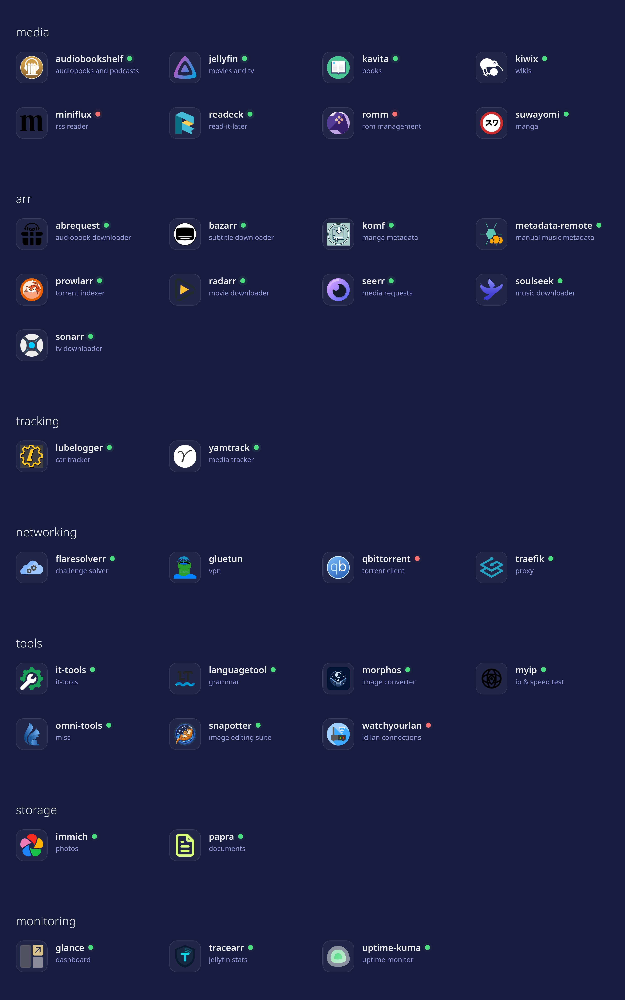

# homelab
Self-hosted homelab running 30+ services via Podman Compose.
- Includes media management, personal finance tooling, document archival, network monitoring, and development utilities.
- Makefile to simplify container orchestration
- Scripts for server hygiene and to fix common problems in an automated manner
- .gitignore to hide secrets, personal data, volume mappings, this repo is for configs only
- Reverse proxy implemented for a few key services

